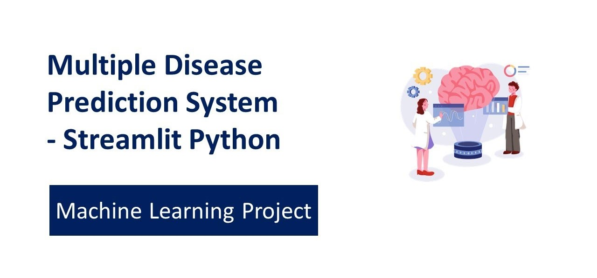

# Multiple Disease Prediction System

* Dataset diabetes.csv 👉🏻
* Dataset heart.csv 👉🏻
* Dataset parkinsons.csv 👉🏻

---
[](https://github.com/ArpitAggarwal10/Multiple_Disease_Prediction_Major-Project.git)

<!-- PROJECT LOGO -->

<br />
<p align="center">
<a href="https://github.com/ArpitAggarwal10/Multiple_Disease_Prediction_Major-Project.git">
  
</a>

<!-- INTRODUCTION -->

## Objective
  
The objective of a Multiple Disease Prediction System, encompassing predictions for diabetes, heart disease, and Parkinson's disease, is to provide an efficient and accessible platform for early detection and risk assessment of these health conditions. The system aims to utilize machine learning models to analyze relevant health data and make predictions based on input parameters.

<!-- ABOUT THE PROJECT -->

## About The Project

1. **Diabetes Prediction**
   - Provide a tool for individuals to assess their risk of developing diabetes.
   - Early identification of individuals who may benefit from lifestyle modifications or medical interventions.
   - Empower users with insights into their diabetes risk factors.

2. **Heart Disease Prediction**
   - Predict the likelihood of an individual having heart disease based on their health parameters.
   - Enable early intervention and lifestyle changes to reduce the risk of heart-related issues.
   - Offer a user-friendly interface for individuals to monitor and manage their cardiovascular health.

3. **Parkinson's Disease Prediction**
   - Detect potential signs of Parkinson's disease through the analysis of specific health metrics.
   - Facilitate early diagnosis, allowing for better management and treatment planning.
   - Raise awareness about Parkinson's disease and promote proactive healthcare measures.

Overall, the system's overarching goal is to contribute to preventive healthcare by identifying potential health risks early on, encouraging timely medical attention, and ultimately improving health outcomes for individuals at risk of these diseases.

## Libraries Used 

```
  * Numpy
  * Scikit-learn
  * Streamlit
  * Streamlit-option-menu
```

## Directory Structure

```sh
├── colab_files_to_train_models
│   └── Multiple disease prediction system - diabetes
│   └── Multiple disease prediction system - heart
│   └── Multiple disease prediction system - Parkinsons
├── dataset
│   └── diabetes.csv
│   └── heart.csv
│   └── parkinsons.csv
├── images
│   └── logo.jpg
│   └── modelview.png
├── saved_models
│   └── diabetes_model.sav
│   └── heart_disease_model.sav
│   └── parkinsons_model.sav
├── .gitignore
├── app.py
├── README.md
├── requirements.txt
```
<!-- GETTING STARTED -->
## Getting Started

This is an example of how you may give instructions on setting up your project locally.
To get a local copy up and running follow these simple example steps.

## Prerequisites

Create a virtualenv. (optional)
  ```sh
  python3 -m venv multipledisease
  source multipledisease/bin/activate
  ```
## Installation

1. Clone the repo
   ```sh
   git clone https://github.com/ArpitAggarwal10/Multiple_Disease_Prediction_Major-Project.git
   ```
2. Install required libraries
   ```sh
   pip install -r requirements.txt
   ```

   <!-- USAGE EXAMPLES -->
## Usage

Now run the app.py file by typing following command 
```sh
   streamlit run app.py
   ```
_For more examples, please refer to the [Documentation](#)_

## About Contribution :
* Raise the `issue` .
* Work on raised issues .
* Come up with interesting Medical related problems and solutions .
* You can improve the UI/UX .
* Can contribute on readme files as well .

---
                          "What we know is a drop, what we don't know is an ocean."
                                                                — Isaac Newton
---

[](https://github.com/ArpitAggarwal10/Multiple_Disease_Prediction_Major-Project.git)

<p align="center">
<a href="https://github.com/ArpitAggarwal10/Multiple_Disease_Prediction_Major-Project.git">
   
</a>